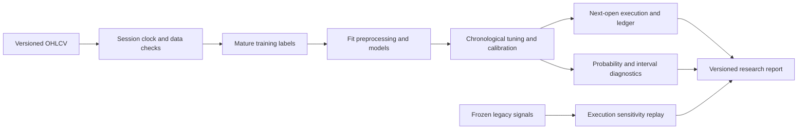

# NVDA Research Platform

A daily research system for comparing signals, execution assumptions and predictive uncertainty. Its purpose is to make results reproducible and challenge apparent edges before using them.

**Current status: research infrastructure; no validated live alpha.** The historical data were already used in development. The new experiments are chronological development evaluations, not an untouched holdout. News remains explanatory because the saved event sample does not meet the eligibility gates.

## What the system demonstrates

- One fill ledger reconciles cash, shares, fees, realized P&L and marked equity, including gaps, partial trades and risk halts.
- Training-only preprocessing and label-maturity purging protect temporal validation; future-price mutation tests exercise real fitted models.
- A registered 11-candidate design compares a fixed volume/momentum rule, logistic regression, shallow boosting and six distribution variants. Calibration, sizing and cost stresses are explicit ablations.
- Frozen historical signals are replayed separately under the original engine, corrected accounting and changed execution assumptions.
- Every run records source/input hashes, dependencies, configuration, inner selections, predictions, fills, metrics and report artifacts.



## Run the offline example

Python 3.13 is supported; the reference environment was created with Python 3.13.9.

```bash
python3.13 -m venv .venv-research
.venv-research/bin/python -m pip install -r research/environment.lock.txt
MPLCONFIGDIR=.mplconfig OMP_NUM_THREADS=1 OPENBLAS_NUM_THREADS=1 \
  .venv-research/bin/python -m nvda_quant_model.research.runner \
  --synthetic --output research/runs/example
NVDA_OFFLINE_TESTS=1 .venv-research/bin/python -m pytest -q
```

The example generates deterministic synthetic OHLCV and requires no API key or live price connection. Its charts are marked synthetic and cannot establish market performance. Market runs accept an explicit CSV with `Date,Open,High,Low,Close,Volume`; see the [runbook](research/RUNBOOK.md).

## Research results and interpretation

The [frozen research report](research/results/frozen_20260918/research_report.md) and its CSV files contain all candidates, including failures. [Execution sensitivity](research/results/frozen_20260918/historical_replay/historical_replay.csv) distinguishes an accounting correction from a changed strategy definition. [The model card](research/MODEL_CARD.md) sets out the remaining limitations.

Historical screenshots must retain their original model, input window and execution identity. A result produced by the old engine cannot be relabeled as an upgraded model's performance. The saved strict/default signals are replayed, not represented as fully regenerated training histories.

## Documentation

- [Model card](research/MODEL_CARD.md): intended use, models, validation and limitations.
- [Runbook](research/RUNBOOK.md): actual-data runs, checkpoints, provenance and shadow records.
- [Data and time contracts](research/DATA_CONTRACT.md): clocks, labels, preprocessing and execution.
- [Technical discussion brief](research/TECHNICAL_BRIEF.md): research decisions and interview explanations.
- [Approved upgrade plan](research/UPGRADE_PLAN.md) and [implementation evidence](research/IMPLEMENTATION_STATUS.md).
- [Earlier repository documentation](docs/LEGACY_REPOSITORY_README.md): existing exploratory tools retained for context.

The v2 implementation was developed with AI-assisted coding and independently reviewed through separate execution, time/data, and model/reporting workstreams. The evidence supports the implemented system and its tests; it does not establish unaided authorship or profitable deployment.
