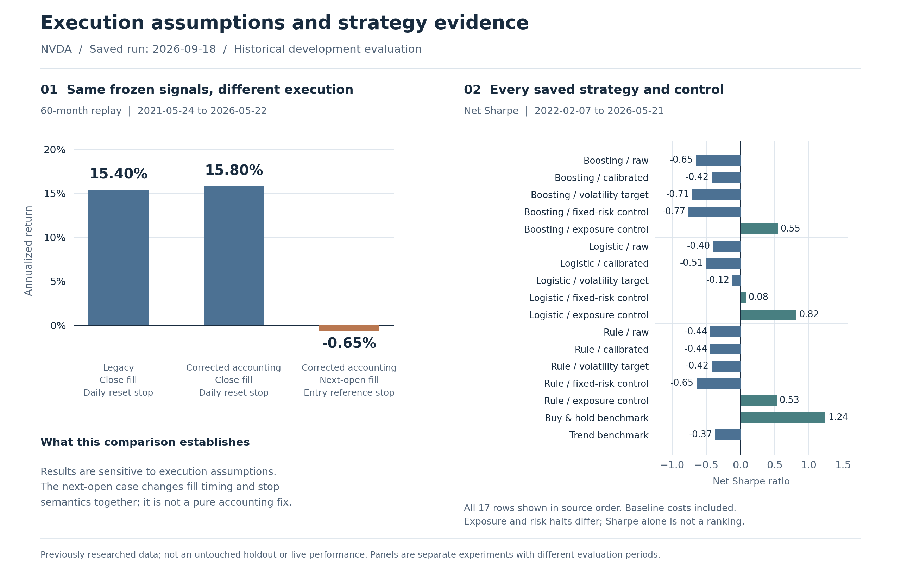
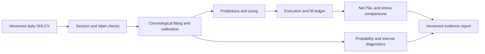
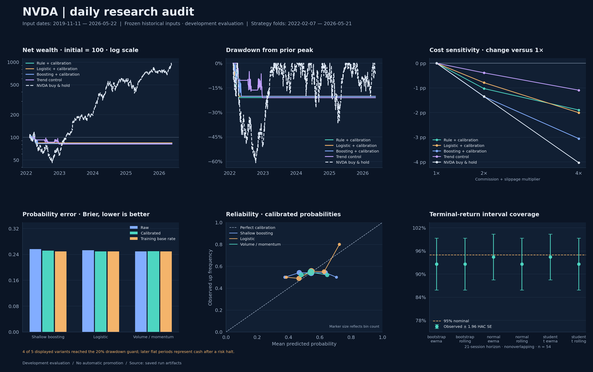

# NVDA Research Lab

**YZ · Cornell · Quantitative Research & Options Risk**

[](https://github.com/yz3639-gif/Nvda_Quant_Model/actions/workflows/research.yml?query=branch%3Amain)

A Python research workflow that tests daily NVDA signals, reconciles simulated fills to account equity, and measures sensitivity to execution rules and trading costs.

**[18 walk-forward folds](research/results/frozen_20260918/folds.json) · [Fill-level accounting](tests/test_execution_v2.py) · [1× / 2× / 4× costs](research/results/frozen_20260918/cost_stress.csv)**

*Historical development evaluation · Main data through May 22, 2026 · No live or untouched-holdout performance claim.*

[](research/results/frozen_20260918/research_report.md)

**[Research](research/results/frozen_20260918/research_report.md) · [Code](nvda_quant_model/research) · [Reproduce](research/RUNBOOK.md)**

[Technical walkthrough](research/TECHNICAL_BRIEF.md) · [Model card](research/MODEL_CARD.md)

The figure compares a frozen-signal execution replay with all 17 v2 strategy/control results. Its two panels are separate experiments. [Figure source](scripts/build_readme_figures.py) · [Replay CSV](research/results/frozen_20260918/historical_replay/historical_replay.csv) · [Strategy results](research/results/frozen_20260918/strategy_summary.csv)

## Research at a glance

| Dimension | Implemented and recorded |
| :--- | :--- |
| Market inputs | **1,641 daily NVDA observations**, November 11, 2019–May 22, 2026 |
| Directional models | **3 families:** volume/momentum rule, logistic regression and shallow gradient boosting |
| Temporal evaluation | **18 walk-forward folds**; 1,075 forecast dates per family; training-only preprocessing and label-maturity checks |
| Trading comparisons | **17 strategy and control variants**, with their losses, exposure and risk halts retained |
| Cost sensitivity | **1×, 2× and 4×** baseline commission and slippage; **51** recorded comparisons |
| Distribution research | **6 variants**, 5- and 21-session horizons, **5,000 simulated paths** per forecast |
| Engineering checks | **196 offline tests passed** in the [September 28 local portfolio check](research/PORTFOLIO_CHECK_20260928.md); [remote workflow](https://github.com/yz3639-gif/Nvda_Quant_Model/actions/runs/36469543095) also passed |

**Data freshness:** the main experiment was run on **September 18, 2026**, using inputs ending **May 22, 2026**. A separate default-strategy execution replay ends July 24, 2026. This publication updates the implementation and explanation; it does not add September market observations. These are historical development evaluations, with no untouched holdout or live performance record claimed.

The registered design has **11 candidate specifications**: five directional-model settings and six distribution variants. This is different from the 17 strategy/control variants, which also vary calibration and sizing. Counts are traceable to the [run manifest](research/results/frozen_20260918/manifest.json), [fold records](research/results/frozen_20260918/folds.json) and [cost results](research/results/frozen_20260918/cost_stress.csv).

## What the implementation demonstrates

- **Time-aware model research.** Model selection and probability calibration use chronological training blocks. Preprocessing is fitted inside training, immature labels are excluded, and future-price mutation tests exercise the fitted models.
- **Execution and accounting.** A fill ledger tracks cash, shares, fees, realized P&L and marked equity. Gap fills, partial trades, stop/target behavior and risk halts have explicit handling and regression coverage.
- **Risk and uncertainty.** The platform compares fixed, volatility-targeted and exposure-control sizing; measures probability reliability; and evaluates return intervals with coverage, width and tail diagnostics.
- **Auditable experiments.** Source/input hashes, dependencies, configuration, folds, predictions, trades and stage checkpoints travel with each result. Failed stages and negative outcomes remain visible.



## What the results show

**Execution assumptions matter.** The 60-month legacy result with Sharpe **1.24** is preserved with its original identity. The same saved signals produce different outcomes under changed assumptions:

| Frozen 60-month signal replay | Annualized return | Sharpe | Maximum drawdown |
| :--- | ---: | ---: | ---: |
| Legacy close execution / daily stop reset | 15.40% | 1.240 | −13.32% |
| Corrected accounting / close execution / daily stop reset | 15.80% | 1.230 | −13.30% |
| Corrected accounting / next-open execution / entry-based stops | −0.65% | −0.023 | −20.84% |

These cases use May 24, 2021–May 22, 2026 observations. The last row changes both fill timing and stop semantics; its difference cannot be attributed solely to an accounting fix. Replay preserves saved signals rather than regenerating the original model-selection history.

**The complete v2 comparison does not establish a durable trading edge.** Five of the 17 strategy/control variants have positive net returns at baseline costs; four remain positive at 4× costs. These counts include controls and buy-and-hold, and are not independent replications. Several strategies hit the drawdown guard; their subsequent cash holdings remain part of the reported result. Exposure controls and buy-and-hold also carry different realized exposure, so a lower drawdown alone is not evidence of better forecasting.

**Calibration and tail diagnostics are part of the research output.** Probability calibration reduces observed Brier error for some models, but the recorded block-bootstrap intervals do not establish a repeatable improvement over the training-frequency benchmark. At the 21-session horizon, nominal 95% interval coverage is approximately 92.6%–94.4% over 54 nonoverlapping outcomes per distribution variant. These are descriptive findings from previously researched data.

[Open the complete report and tables](research/results/frozen_20260918/research_report.md) for returns, costs, probability scores, parameter sensitivity and failures.

<details>
<summary><strong>Open the broader research dashboard</strong></summary>



This dashboard displays a prespecified subset for legibility. The table and figure above retain all 17 strategy/control variants. Flat strategy paths after a risk halt represent cash, not missing observations.

</details>

## Reproduce an offline example

The synthetic example runs without an API key or market-data account. It exercises the same research pipeline; its output is labeled synthetic and is not market-performance evidence.

```bash
git clone https://github.com/yz3639-gif/Nvda_Quant_Model.git
cd Nvda_Quant_Model
python3.13 -m venv .venv-research
.venv-research/bin/python -m pip install -r research/environment.lock.txt

NVDA_OFFLINE_TESTS=1 OMP_NUM_THREADS=1 OPENBLAS_NUM_THREADS=1 \
  .venv-research/bin/python -m pytest -q -p no:cacheprovider

MPLBACKEND=Agg MPLCONFIGDIR=.mplconfig OMP_NUM_THREADS=1 OPENBLAS_NUM_THREADS=1 \
  .venv-research/bin/python -m nvda_quant_model.research.runner \
  --synthetic --config research/configs/smoke.json --output research/runs/example
```

The reference environment is Python 3.13.9. Windows users should use the corresponding virtual-environment executable and shell environment-variable syntax. For historical market runs, provide an authorized CSV with `Date,Open,High,Low,Close,Volume`; the original full vendor cache is not bundled. A fresh download is a new data vintage, not automatically an exact reproduction. See the [runbook](research/RUNBOOK.md).

## Automated verification

The [offline research workflow](.github/workflows/research.yml) uses Python 3.13.9 and the pinned environment. Each push and pull request runs the publication hash checks, the socket-blocked regression suite, and a two-fold synthetic smoke example in a new output directory. Its uploaded synthetic report is a pipeline check, not market-performance evidence. The [Actions history](https://github.com/yz3639-gif/Nvda_Quant_Model/actions/workflows/research.yml) records the status for each commit; [dated local verification](research/PORTFOLIO_CHECK_20260928.md) is recorded separately.

## Review the implementation

| Research question | Code | Evidence |
| :--- | :--- | :--- |
| Was training information available at the decision time? | [Model experiments](nvda_quant_model/research/experiments.py) | [Fold records](research/results/frozen_20260918/folds.json), [time contract](research/DATA_CONTRACT.md) |
| Do simulated trades reconcile to account equity? | [Backtest and ledger](nvda_quant_model/backtest/backtest_engine.py) | [Per-strategy ledgers](research/results/frozen_20260918/backtests), [execution tests](tests/test_execution_v2.py) |
| How much depends on costs or trading assumptions? | [Historical replay](nvda_quant_model/research/replay.py) | [Execution comparison](research/results/frozen_20260918/historical_replay/historical_replay.csv), [cost stress](research/results/frozen_20260918/cost_stress.csv) |
| Are probabilities and return intervals useful? | [Distribution models](nvda_quant_model/research/distributions.py) | [Probability scores](research/results/frozen_20260918/probability_scores.csv), [distribution diagnostics](research/results/frozen_20260918/distribution_summary.csv) |
| Can a run be reproduced or resumed safely? | [Runner](nvda_quant_model/research/runner.py), [provenance](nvda_quant_model/research/provenance.py) | [Recorded reproduction checks](research/REPRODUCTION_CHECK.json), [publication verification](research/PUBLICATION_CHECK.md) |

The earlier independent reproduction matched 12 principal result tables byte-for-byte in the reference environment. That historical check is distinct from the current publication tests and from cross-platform reproducibility. [Public metadata normalization](research/PUBLICATION_NOTES.md) is documented separately; original run identities and numerical results remain distinguishable from publication artifacts.

## Scope and next validation

This project demonstrates daily equity research, execution modeling and risk diagnostics. It does not implement an options market-making desk or establish a live trading track record. The related [WTI Options Desk](https://github.com/yz3639-gif/cushing-wti-research) demonstrates option valuation, volatility editing and scenario-based proxy hedging separately.

The next empirical step is a fixed prospective experiment using newly recorded inputs, with the forecast horizon aligned to the holding-period policy and explicit turnover/cost controls. Shadow-recording support exists, but a prospective performance history has not yet been collected. The news sample has 26 events and fails its source/time-coverage gate, so no news-alpha claim is made.

## 中文导读

这个项目展示的是一套可检查、可复现的量化研究流程：比较 NVDA 日频信号，把预测转化为模拟交易，再核对成本、损益和风险。主要工作包括 18 个滚动验证窗口、三档交易成本压力测试、逐笔成交记账，以及概率和收益区间诊断。

阅读时请区分**报告生成日期、行情截止日期和模型版本**。9 月生成的报告使用截止 5 月的主研究数据；旧版 1.24 Sharpe 保留为特定历史假设下的结果。新版把不同执行规则、失败案例和全部策略对照放在同一份证据记录中，不将历史开发回测包装成全新样本外或实盘收益。

技术讨论建议先看 [Technical walkthrough](research/TECHNICAL_BRIEF.md)，复现方法见 [Runbook](research/RUNBOOK.md)。旧页面留在 [历史文档](docs/LEGACY_REPOSITORY_README.md)，用于追溯此前的模型和表述。
