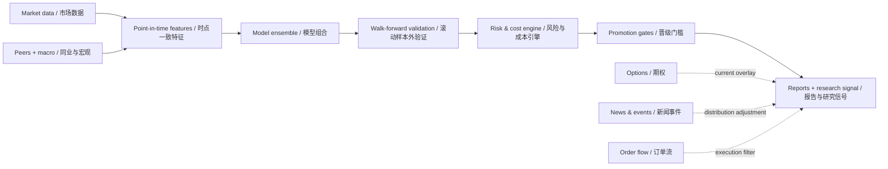

> **Historical documentation — superseded by the [current research overview](../README.md).**
> This is the earlier public description and May 2026 baseline. Its production/current labels and backtest metrics do not describe the v2 experiment. For the dated data, model and execution boundaries, use the [model card](../research/MODEL_CARD.md).

# NVDA Quant Research Engine | 英伟达多因子量化研究系统

<p align="center">
  
  
  
  
</p>

> A point-in-time-aware, walk-forward research stack for probabilistic NVDA forecasting, strategy validation, and risk-controlled signal research.
>
> 面向 NVDA 概率预测、策略验证与风险约束信号研究的量化系统，强调时点一致性、滚动样本外验证与可审计性。

This repository is designed as a **research and decision-support system**, not a black-box price target generator. It combines multi-factor models, semiconductor peer context, market-regime controls, transaction-cost-aware backtesting, probability calibration, and explicit overfitting audits.

本仓库定位为**研究与决策支持系统**，而非黑箱目标价工具。系统整合多因子模型、半导体同业信息、市场状态控制、交易成本回测、概率校准和显式过拟合审计。

## Executive Snapshot | 核心概览

| Dimension / 维度 | What the system does / 系统能力 |
|---|---|
| Research target / 研究标的 | NVDA directional probability, return distribution, and rule-based strategy behavior / NVDA 方向概率、收益分布与规则策略表现 |
| Validation / 验证 | Rolling walk-forward tests, 24/36/60-month windows, regime diagnostics, and candidate promotion gates / 滚动样本外、24/36/60 个月窗口、状态诊断与候选晋级门槛 |
| Models / 模型 | ElasticNet/Logit, Random Forest, HistGradientBoosting, optional XGBoost, heuristics, bootstrap, and GBM variants / 线性、树模型、启发式、历史自助法与 GBM 系列 |
| Risk / 风控 | Costs, slippage, stop-loss, take-profit, drawdown controls, calibration, and tail-coverage checks / 成本、滑点、止损止盈、回撤控制、校准与尾部覆盖检查 |
| Live overlays / 实时叠加层 | Options volatility, news/event impact, and top-of-book/order-flow context / 期权波动率、新闻事件影响与盘口/订单流信息 |
| Output / 输出 | Reproducible CSV/JSON artifacts, reports, equity curves, drawdown and rolling-Sharpe charts / 可复算表格、报告、净值曲线、回撤与滚动 Sharpe 图表 |

## Historical Backtest Return | 历史回测回报

The current audited research baseline uses a **2.5% stop-loss** and **4.0% take-profit**. The repository's 2026-05-25 retest reports:

当前经审计的研究基线采用 **2.5% 止损**与 **4.0% 止盈**。仓库内 2026-05-25 复验结果如下：

| Window / 窗口 | Annualized return / 年化回报 | Sharpe | Max drawdown / 最大回撤 | Win rate / 胜率 | Profit factor / 利润因子 | Trades / 交易数 |
|---:|---:|---:|---:|---:|---:|---:|
| 24 months / 24个月 | **27.10%** | **2.41** | **-2.94%** | **75.00%** | **6.64** | 32 |
| 36 months / 36个月 | **18.71%** | **1.59** | **-13.32%** | **62.96%** | **3.17** | 54 |
| 60 months / 60个月 | **15.40%** | **1.24** | **-13.32%** | **56.99%** | **2.32** | 93 |

**How to read this / 如何解读：** “Return” means historical annualized strategy return under the repository's backtest assumptions—not realized account performance, a forecast, or a guaranteed ROI. Results come from different trailing windows and are not additive. See [`MODEL_REMEDIATION_PLAN.md`](../nvda_quant_model/MODEL_REMEDIATION_PLAN.md) and [`production_model.py`](../nvda_quant_model/production_model.py) for the audit trail and active override.

“回报”指仓库回测假设下的历史策略年化收益，不代表实盘账户业绩、未来预测或保证回报。不同窗口不可相加。审计过程与当前参数覆盖见上述文件。

> **Audit status / 审计状态： `PASS_BUT_FRAGILE`.** The baseline passes hard gates, but the 60-month return margin is thin, only 1 of 9 nearby stop/take combinations passed all gates, shorter windows have limited trades, 2022 precision was weak, and tail coverage remains imperfect.
>
> **审计结论：`PASS_BUT_FRAGILE`。** 基线通过硬门槛，但 60 个月年化安全垫较薄，邻近止损止盈参数仅 1/9 全部通过，短窗口样本有限，2022 年精度偏弱，尾部覆盖仍不充分。

## System Architecture | 系统架构



The live overlays are intentionally separated from historical training unless point-in-time history is available. This prevents current information from leaking into past simulations.

除非具备严格的历史时点数据，实时叠加层不会进入历史训练，以防止当前信息泄漏到过去的回测中。

## Research Stack | 研究模块

### 1. Multi-factor core | 多因子核心

- NVDA OHLCV, technical and volatility features / NVDA 行情、技术与波动率特征
- Sector and macro proxies / 行业与宏观代理变量
- Peer features for AMD, AVGO, TSM, ASML, MU, QCOM, INTC, and ARM / 半导体同业特征
- Walk-forward model comparison and feature importance / 滚动模型比较与特征重要性

### 2. Distribution engine | 概率分布引擎

- Historical moving-block bootstrap / 历史移动区块自助法
- GBM Normal and Student-t Monte Carlo / 正态与 Student-t GBM 蒙特卡洛
- Probability calibration, PIT diagnostics, and interval-coverage testing / 概率校准、PIT 诊断与区间覆盖率检验

### 3. Research overlays | 研究叠加层

- Option-implied move, IV/HV regime, and skew / 期权隐含波动、IV/HV 状态与偏斜
- Point-in-time news and event impact / 时点一致的新闻与事件影响
- Best bid/ask, spread, quote imbalance, and minute trend / 最优买卖价、价差、报价不平衡与分钟趋势

### 4. Model governance | 模型治理

- Hard promotion gates across 24/36/60-month windows / 跨窗口硬性晋级门槛
- Rolling out-of-sample degradation checks / 滚动样本外退化检查
- Parameter-neighborhood and regime fragility audits / 参数邻域与市场状态脆弱性审计
- Baseline-preserving repair search / 不破坏基线的修复型搜索

## Quick Start | 快速开始

### Install | 安装

```bash
python3.13 -m venv .venv
source .venv/bin/activate
python -m pip install --upgrade pip
python -m pip install -r requirements.txt
```

### Run the default NVDA workflow | 运行默认 NVDA 流程

```bash
python -m nvda_quant_model.main
```

Use a trusted live reference price when you want stop/take levels anchored to a specific quote:

如需将止损止盈锚定到可信实时价格，可使用：

```bash
python -m nvda_quant_model.main --price-override 214.30
```

### Validate the production research baseline | 验证当前研究基线

```bash
python -m nvda_quant_model.overfit_audit
```

### Search without silently replacing the baseline | 搜索候选但不自动替换基线

```bash
python -m nvda_quant_model.stable_candidate_optimizer \
  --strict-results nvda_quant_model/outputs/long_run_optimizer_repaired/long_run_results.csv \
  --high-sample-results nvda_quant_model/outputs/high_sample_optimizer_repaired/high_sample_results.csv \
  --output-dir nvda_quant_model/outputs/stable_candidate_optimizer \
  --hours 6 \
  --resume
```

## Calibration Evidence | 校准证据

The documented engine audit uses ten years of NVDA history, a 21-trading-day horizon, five-year training windows, 5,000 simulations, and 247 evaluation windows per method. Reported 80%/95% interval coverage was:

引擎审计使用十年 NVDA 历史、21 个交易日预测期、五年训练窗、5,000 次模拟，每种方法 247 个评估窗口。80%/95% 区间覆盖率为：

| Engine / 引擎 | 80% coverage / 覆盖率 | 95% coverage / 覆盖率 |
|---|---:|---:|
| Historical bootstrap / 历史自助法 | 78.14% | 91.90% |
| GBM Normal / 正态 GBM | 81.78% | 92.31% |
| GBM Student-t | 80.57% | 93.12% |

These results support model comparison while also showing under-coverage in the 95% tails. The system therefore reports calibration limitations instead of presenting false precision.

这些结果既支持模型比较，也暴露了 95% 尾部区间覆盖不足的问题，因此系统会披露校准限制，而不是输出伪精确结论。

## Outputs | 输出文件

The main workflow writes to `nvda_quant_model/outputs/`:
主流程输出至 `nvda_quant_model/outputs/`：

| Artifact / 文件 | Purpose / 用途 |
|---|---|
| `report.md`, `summary.json` | Human- and machine-readable research summary / 人类与机器可读的研究摘要 |
| `signals.csv`, `trades.csv` | Signal and simulated-trade audit trail / 信号与模拟交易审计轨迹 |
| `walk_forward.csv` | Out-of-sample evaluation records / 样本外评估记录 |
| `model_comparison.csv` | Cross-model performance comparison / 跨模型表现对比 |
| `data_quality.csv`, `data_quality.json` | Data-quality diagnostics / 数据质量诊断 |
| `equity_curve.png`, `drawdown.png` | Return path and drawdown visualization / 收益路径与回撤可视化 |
| `monthly_returns_heatmap.png`, `rolling_sharpe.png` | Regime and stability views / 市场状态与稳定性视图 |

## Repository Map | 仓库结构

```text
nvda_quant_model/          Core NVDA research engine / NVDA 核心研究引擎
├── backtest/              Walk-forward and execution simulation / 回测与执行模拟
├── data/                  Ingestion and validation / 数据接入与验证
├── event_overlay/         Point-in-time event layer / 时点事件叠加层
├── outputs/               Generated research artifacts / 生成的研究产物
├── overfit_audit.py       Fragility and promotion audit / 脆弱性与晋级审计
└── production_model.py    Audited baseline overrides / 经审计的基线参数
spy_forecast_tool/         General probability-distribution CLI / 通用概率分布工具
src/                       Alpaca integration / Alpaca 接入层
tests/                     Automated tests / 自动化测试
```

## Research Standards | 研究标准

- **Point-in-time first / 时点一致优先：** historical features must be observable at the prediction timestamp / 历史特征必须在预测时点真实可得。
- **No single-window promotion / 禁止单窗口晋级：** candidates must survive multiple horizons and rolling OOS checks / 候选必须通过多窗口与滚动样本外检查。
- **Overlays are not alpha by default / 叠加层不默认等于超额收益：** live news, options, and order flow remain contextual until independently validated / 实时新闻、期权与订单流须独立验证。
- **Failure is an output / 失败也是结果：** insufficient data, under-coverage, and rejected candidates are explicitly reported / 数据不足、覆盖不足与候选淘汰均需明确记录。

## Limitations & Disclaimer | 局限与免责声明

Backtests are sensitive to data revisions, survivorship and selection bias, market regimes, costs, parameter search, and execution assumptions. Free Yahoo data and best-effort fundamentals are not institutional point-in-time datasets. Replace them with audited data before any serious live deployment.

回测会受到数据修订、幸存者偏差、选择偏差、市场状态、交易成本、参数搜索与执行假设影响。免费 Yahoo 数据及尽力获取的基本面数据不属于机构级时点数据库，严肃实盘前应替换为经审计的数据源。

**This repository is for research and education only. It is not investment advice, an offer, or a guarantee of future returns.**

**本仓库仅用于研究与教育，不构成投资建议、证券要约或未来收益保证。**
